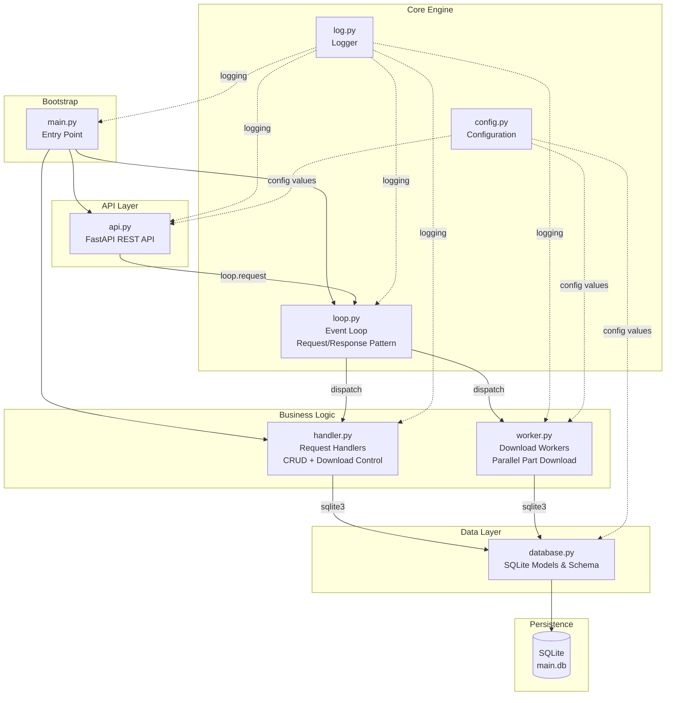
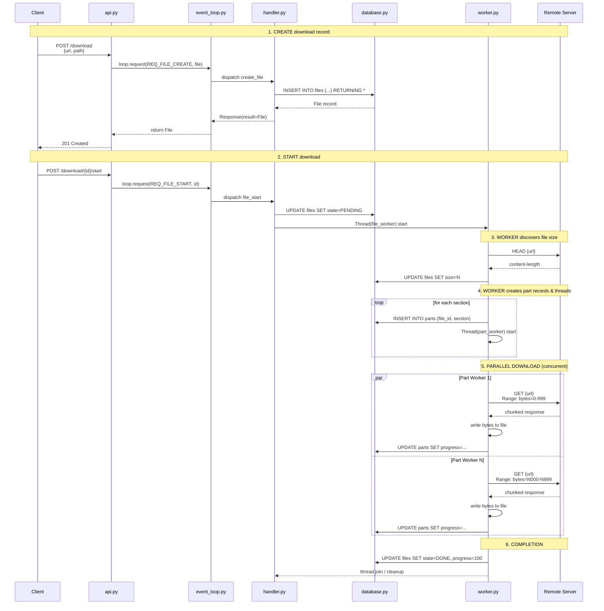
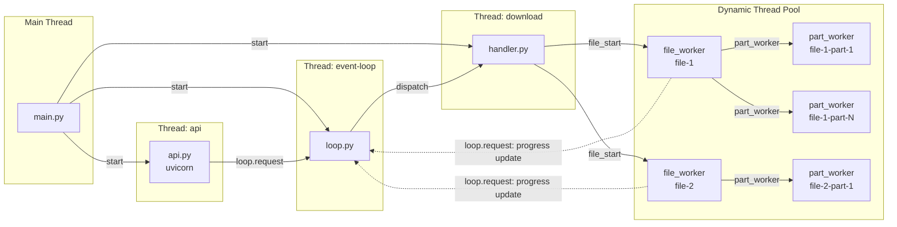
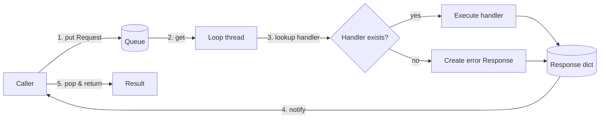

# Architecture Overview

---

## System Architecture

The application follows a layered architecture with a custom thread-safe event loop at its core. All components run in separate threads coordinated by the `Loop` class.

---

## Component Responsibilities

| Component | File | Responsibility |
|-----------|------|----------------|
| **Bootstrap** | `main.py` | Starts all threads, joins them on shutdown |
| **API** | `api.py` | Exposes REST endpoints, translates HTTP requests into event-loop requests |
| **Event Loop** | `loop.py` | Thread-safe request/response message broker; dispatches work to registered handlers |
| **Handlers** | `handler.py` | Implements business logic for CRUD operations and download start/stop |
| **Workers** | `worker.py` | Manages per-file and per-part download threads; handles progress tracking |
| **Database** | `database.py` | Defines data models (`File`, `Part`) and SQLite schema |
| **Config** | `config.py` | Loads and provides environment-variable-based configuration |
| **Logger** | `log.py` | Configures structured logging via loguru |

---

## Data Flow: Download Lifecycle

---

## Concurrency Model

Key concurrency features:

- **Shared state protection**: A `Lock` guards the `shared` dictionary (active file threads).
- **Per-file semaphore**: A `Semaphore` limits the number of concurrent part downloads per file (configured via `PARALLEL_CONNECTION`).
- **Thread-safe event loop**: The `Loop` class uses a `Queue` for incoming requests and a `Condition` for wait/notify synchronization.
- **Graceful stop**: An `Event` per file thread signals part workers to stop early.

---

## Request/Response Pattern (Event Loop)

The custom `Loop` class bridges the synchronous FastAPI thread and the download worker threads:

Each request carries a unique `uuid4` identifier. The caller blocks on a `Condition.wait()` until the loop thread processes the request and notifies all waiters.
