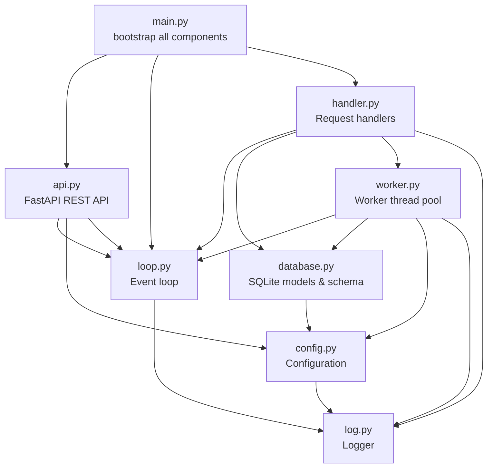

# Module Catalog

All source modules are located in `src/`. Each file declares its name and description in a header docstring.

---

## Module Overview



---

## Module Details

### `main.py` — Bootstrap

**Header:** `bootstrap all components`

The application entry point. It defines three daemon threads — `event-loop`, `api`, and `download` — starts them all, then joins them. The `main()` function is invoked when the module is run directly.

```python
threads: list[Thread] = [
    Thread(name="event-loop", target=loop.loop),
    Thread(name="api", target=api_init),
    Thread(name="download", target=handler_init),
]
```

**Dependencies:** `loop`, `api`, `handler`, `log`

---

### `api.py` — FastAPI REST API Endpoints

**Header:** `FastAPI REST API endpoints for download management`

Exposes a FastAPI application with seven REST endpoints for download management. Each endpoint translates HTTP requests into `loop.request()` calls with a specific `Code` enum value. The `init()` function starts uvicorn.

| Method | Endpoint | Code |
|--------|----------|------|
| `GET` | `/download` | `REQ_FILE_GET_ALL` |
| `GET` | `/download/{id}` | `REQ_FILE_GET` |
| `POST` | `/download` | `REQ_FILE_CREATE` |
| `PATCH` | `/download/{id}` | `REQ_FILE_UPDATE` |
| `DELETE` | `/download/{id}` | `REQ_FILE_DELETE` |
| `POST` | `/download/{id}/start` | `REQ_FILE_START` |
| `POST` | `/download/{id}/stop` | `REQ_FILE_STOP` |

**Dependencies:** `fastapi`, `uvicorn`, `database`, `loop`, `config`

---

### `loop.py` — Event Loop

**Header:** `Event loop for handling async requests with thread-safe request/response pattern`

A custom thread-safe event loop built on `queue.Queue` and `threading.Condition`. The `Loop` class maintains:

- A `_handlers` dict mapping `Code` enum values to handler functions
- A `_queue` for incoming requests
- A `_response` dict for completed responses
- A `_notify` condition variable for caller synchronization

The `handler` decorator registers a function for a given `Code`. The `loop` method continuously processes requests from the queue. The `request` method submits a request and blocks until a response is available.

**Defined types:**
- `Code` — Enum of 12 request codes (file CRUD, part CRUD, start, stop)
- `Function` — Type alias for `Callable[..., Any]`
- `Request` — Dataclass with `idx`, `code`, `args`, `kwargs`
- `Response` — Dataclass with `idx`, `code`, `error`, `result`

**Dependencies:** `enum`, `queue`, `threading`, `uuid`, `log`

---

### `handler.py` — Request Handlers

**Header:** `Request handlers for file/part CRUD operations and download control`

Implements all handler functions registered with the event loop via `@loop.handler(Code.XXX)`. Provides:

- **File CRUD:** `get_all_file`, `get_file`, `create_file`, `update_file`, `delete_file`
- **Part CRUD:** `get_all_part`, `get_part`, `create_part`, `update_part`, `delete_part`
- **Download control:** `file_start`, `file_stop`

The `file_start` handler transitions a file to `PENDING` state, creates a `file_worker` thread, and registers it in the shared dictionary. The `file_stop` handler signals the worker to stop and resets state to `IDEL`.

**Dependencies:** `worker`, `database`, `loop`, `log`

---

### `worker.py` — Worker Thread Pool

**Header:** `Worker thread pool for parallel file download with progress tracking`

Contains the core download logic:

- **`file_worker(file)`**: Determines file size via `httpx.head`, truncates the output file to the required size, creates `PARALLEL_CONNECTION` part records, spawns `part_worker` threads, waits for all to complete, then marks the file `DONE`.
- **`part_worker(part)`**: Downloads a byte-range section of the file using `httpx.stream` with a `Range` header, writes bytes to the correct offset in the file, and periodically reports progress in 5% increments.

**Shared state:**

```python
lock = Lock()
shared: dict[int, FileThread] = {}
```

**Defined types:**
- `FileThread` — Dataclass with `value` (File), `thread`, `event_stop`, `semaphore`, `parts`
- `PartThread` — Dataclass with `value` (Part), `thread`, `event_stop`

**Dependencies:** `httpx`, `config`, `loop`, `database`, `log`

---

### `database.py` — SQLite Database Models & Schema

**Header:** `SQLite database models and schema for file/part download management`

Defines the SQLite schema (two tables: `files` and `parts`) and corresponding dataclass models.

**Schema:**
```sql
CREATE TABLE files (
    id INTEGER PRIMARY KEY AUTOINCREMENT,
    url TEXT NOT NULL,
    path TEXT NOT NULL,
    size INTEGER NOT NULL DEFAULT 0,
    state INTEGER NOT NULL DEFAULT 0,
    progress REAL NOT NULL DEFAULT 0
);

CREATE TABLE parts (
    id INTEGER PRIMARY KEY AUTOINCREMENT,
    file_id INTEGER NOT NULL,
    section INTEGER NOT NULL,
    size INTEGER NOT NULL DEFAULT 0,
    state INTEGER NOT NULL DEFAULT 0,
    progress REAL NOT NULL DEFAULT 0,
    FOREIGN KEY (file_id) REFERENCES files(id)
);
```

**Defined types:**
- `State` — IntEnum with `IDEL=0`, `PENDING=1`, `ERROR=2`, `DONE=3` (note: `IDEL` is a historical spelling of `IDLE`)
- `File` — Dataclass with `id`, `url`, `path`, `size`, `state`, `progress`
- `Part` — Dataclass with `id`, `file_id`, `section`, `size`, `state`, `progress`

A `database_lock` (threading.Lock) is used to serialise write access. WAL journal mode is enabled at startup.

**Dependencies:** `sqlite3`, `threading`, `config`

---

### `config.py` — Configuration Management

**Header:** `Configuration management with environment variable loading`

Loads environment variables (optionally from a `.env` file) and exposes them as an immutable `MappingProxyType` dict.

**Keys:**
| Key | Default | Purpose |
|-----|---------|---------|
| `PARALLEL_DOWNLOAD` | `2` | Max concurrent file downloads |
| `PARALLEL_CONNECTION` | `8` | Connections per file (sections) |
| `DATABASE_PATH` | `main.db` | SQLite database file path |
| `HOST` | `0.0.0.0` | API bind address |
| `PORT` | `3000` | API port |

**Dependencies:** `os`, `pathlib`, `dotenv`, `log`

---

### `log.py` — Logger

**Header:** `logger, just init logger from loguru library`

Configures the loguru logger to output to stdout with colourisation and queue-based concurrency support (`enqueue=True`). The default sink is removed first to prevent duplicate output.

```python
log.remove()
log.add(sys.stdout, colorize=True, enqueue=True,
        format="{time} {level}: {message}")
```

**Dependencies:** `sys`, `loguru`
